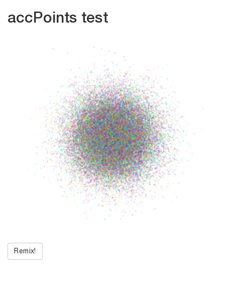

# Shiny WebGL accelerated pointcloud!

Current status: Proof-of-concept; will improve soon (zooming!)



## How-to

```R
library(shiny)
library(shinyAccPoints)

ui <- fluidPage(
  titlePanel("accPoints test"),
  accPointsOutput('accPtsTest')
)

server <- function(input, output) {
  output$accPtsTest <- renderAccPoints(accPoints(
    x = rnorm(100),
    y = rnorm(100),
    xlim = c(-5,5),
    ylim = c(-5,5),
    col = rainbow(100)
  ))
}

shinyApp(ui, server)
```

You may want to run `test.R`.

## Future development

- Adding more features
  - zooming
  - color switching
  - point shape parameters, perhaps better shaders
- Beating some efficiency out of R to get raw data throughput (see the notice in `R/accPoints.R`)


